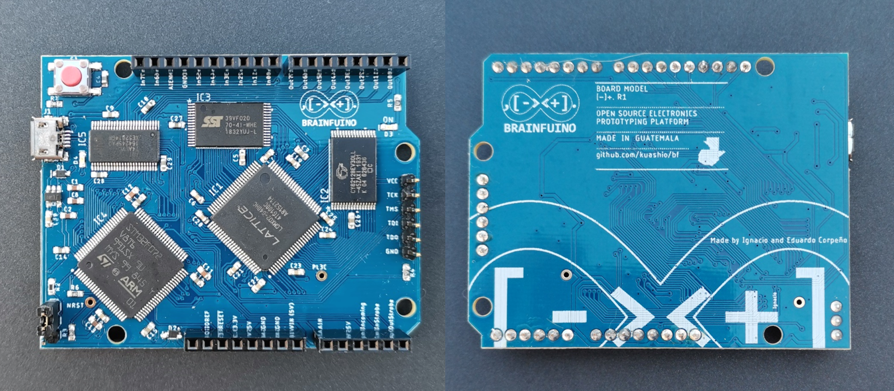

# Brainfuino [-]+.

```text
  ____            _        __       _             
 | __ ) _ __ __ _(_)_ __  / _|_   _(_)_ __   ___  
 |  _ \| '__/ _` | | '_ \| |_| | | | | '_ \ / _ \ 
 | |_) | | | (_| | | | | |  _| |_| | | | | | (_) |
 |____/|_|  \__,_|_|_| |_|_|  \__,_|_|_| |_|\___/ 
```

An Arduino competitor that runs native brainfuck! I've condensed the explanation in this video: https://youtu.be/QloNq8AoHvU

[](https://youtu.be/QloNq8AoHvU)

[](https://m-archibald.github.io/Brainfuino/)
[](https://m-archibald.github.io/Brainfuino/)
[](https://youtu.be/QloNq8AoHvU)
[](https://hackaday.io/project/176757-brainfuino)

> ### 📖 [Read the Official Brainfuino Documentation](https://m-archibald.github.io/Brainfuino/)
> Comprehensive guides covering quick start, hardware architecture, FPGA toolchain, DirtyJTAG flashing, STM32 firmware, and Brainfuck programming are live at **[https://m-archibald.github.io/Brainfuino/](https://m-archibald.github.io/Brainfuino/)**!

Before going further, please make sure you know (or remember) what brainfuck is. [Here's Wikipedia's entry as a refresher](https://en.wikipedia.org/wiki/Brainfuck).

Also, before moving forward: This is not a joke. It ***is*** about a joke programming language, but a joke lots of nerds are very fond of. When I say nerds, I mean real geeks: Not gamers or technophiles, but geeks who like to read [The Art of Computer Programming](https://en.wikipedia.org/wiki/The_Art_of_Computer_Programming) just for kicks!

The Brainfuino [-]+. (pronounced "Brainfuino Uno") is a development board for a brainfuck soft processor written in Verilog, named [***brainfuck_uP***](./brainfuck_uP-FPGA-softprocessor/) (as in "brainfuck microprocessor"), which runs brainfuck code natively—that is, the plain ASCII text of a brainfuck source file directly in hardware.

Here are some details:

- **brainfuck_uP** is implemented in a Lattice MachXO2 FPGA, very much like the one in the [TinyFPGA AX2](https://www.sparkfun.com/products/14828) board, but in a TQFP100 package.
- **Harvard Architecture:** It has two separate parallel buses for its program and data memories.
- **Dedicated Memory:** The Brainfuino has a 128 kB parallel RAM chip and a 256 kB parallel ROM chip to work as the data and program memories of brainfuck_uP respectively.
- **5V Level Shifting:** The I/O is adapted from 3.3V logic to TTL with a dedicated transceiver chip to match Arduino Uno shield compatibility.
- **STM32 Coprocessor:** The host computer interface is a USB Virtual COM port implemented with an STM32F072 MCU, which drives the clock, manages input/output, and handles flashing Brainfuck code to ROM.
- **Analog Input:** The MCU also donates its ADC to give Brainfuino the power of analog input.
- **In-System Programming:** The board includes hardware headers for updating both the MCU firmware and the FPGA bitstream.

## Why Brainfuino? (Or: The Arduino "Competitor")

This product is intended as anything around brainfuck and esoteric programming languages: An elaborate joke, a technical feat, and a geek toy.

If we take the Arduino Uno as a playful benchmark, here are the highlights:

- **Native Brainfuck Execution:** Brainfuino runs raw Brainfuck ASCII instructions directly in silicon logic gates—no interpreters, emulators, or compilers.
- **One-of-a-Kind Architecture:** The only dedicated physical development board built around a native Brainfuck soft-processor core.
- **Arduino Uno Shield Compatibility:** 5V level-shifted parallel digital I/O and an analog input channel provided by the STM32 companion MCU.
- **Educational Value:** A transparent, full-stack learning platform for FPGA soft-processor development, computer architecture, memory bus design, and esoteric computing.
- **Unrivaled Bragging Rights:** Nothing compares to the satisfaction of writing non-trivial software in an 8-instruction Turing-complete language and seeing it execute on physical hardware!

## Computer Languages

There are three computer languages involved. Only the first one is really intended for the end-user:

- **brainfuck:** Users will write their code in brainfuck, and the Brainfuino will run it.
- **Verilog:** brainfuck_uP was written in Verilog. The final `.jed` file may be written into the FPGA's internal flash at any time.
- **C/C++:** The firmware in the STM32 MCU was written in C. This firmware can be written into the MCU at any time as well.

## Repository Structure

This repository is the consolidated monorepo for the Brainfuino project:

- [`brainfuino-PCB/`](./brainfuino-PCB/): PCB design files for **Rev 1.0** (Autodesk Eagle) and **Rev 1.1** (KiCad with JLCPCB fabrication files, BOM, and CPL).
- [`brainfuck_uP-FPGA-softprocessor/`](./brainfuck_uP-FPGA-softprocessor/): Lattice MachXO2 soft-processor written in Verilog, constraint files (`.lpf`), and Lattice Diamond project.
- [`companion-STM32-firmware/`](./companion-STM32-firmware/): STM32F072 firmware (STM32CubeIDE project) providing USB CDC serial terminal, clock synthesis (500 kHz – 48 MHz), and ROM programming.
- [`3D-printable-case/`](./3D-printable-case/): CAD models (`.SLDPRT` and `.STEP`) for the 3D-printable enclosure.
- [`documentation/`](./documentation/): Comprehensive MkDocs documentation suite.

## Project Origins & Acknowledgements

The Brainfuino project was originally conceived and created by **Eduardo Corpeño** ([kuashio](https://github.com/kuashio)). 
- Video Demonstration: [Brainfuino: Hardware Brainfuck Processor (YouTube)](https://youtu.be/QloNq8AoHvU)
- Project Build Log: [Brainfuino on Hackaday.io](https://hackaday.io/project/176757-brainfuino)
- Original soft-processor: [kuashio/brainfuck_uP](https://github.com/kuashio/brainfuck_up)
- Original companion MCU firmware: [kuashio/brainfuino-firmware](https://github.com/kuashio/brainfuino-firmware)
- Brainfuck IDE: [Visual brainfuck](https://sites.google.com/site/visualbf/)

Continued and maintained by Matthew Archibald (Hardware, KiCad Rev 1.1 redesign, 3D case, and documentation) and Thalia Archibald (Software architecture, compiler design, and curator of the [bfcorpus repository](https://github.com/thaliaarchi/bfcorpus)).

---

### 📚 Official Documentation

For step-by-step assembly guides, hardware schematics, flashing tutorials, and the future roadmap:  
👉 **[https://m-archibald.github.io/Brainfuino/](https://m-archibald.github.io/Brainfuino/)**
