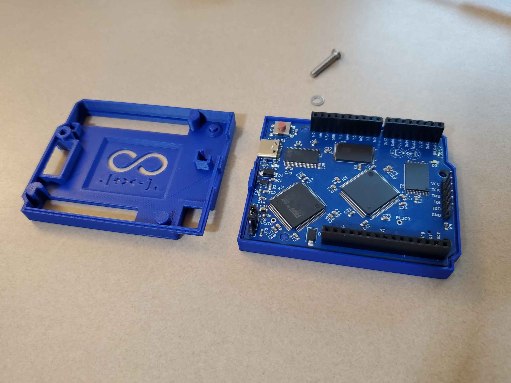
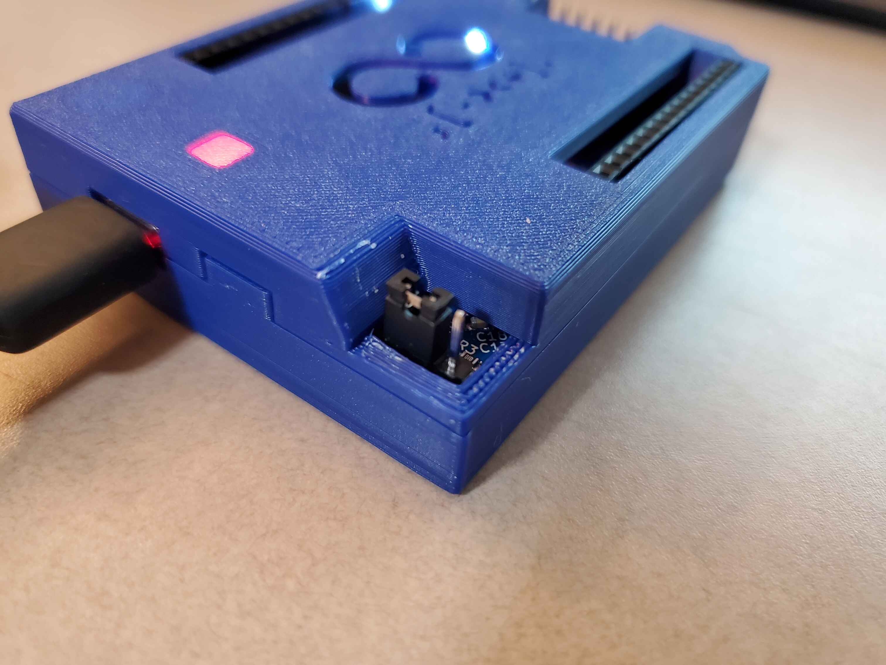
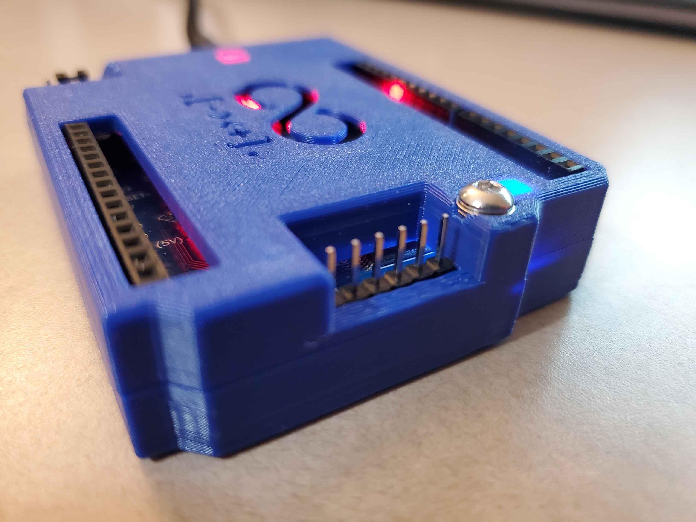
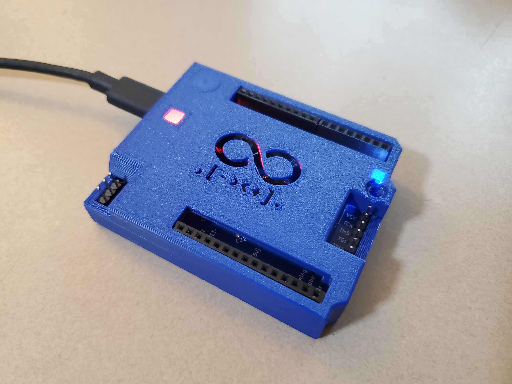
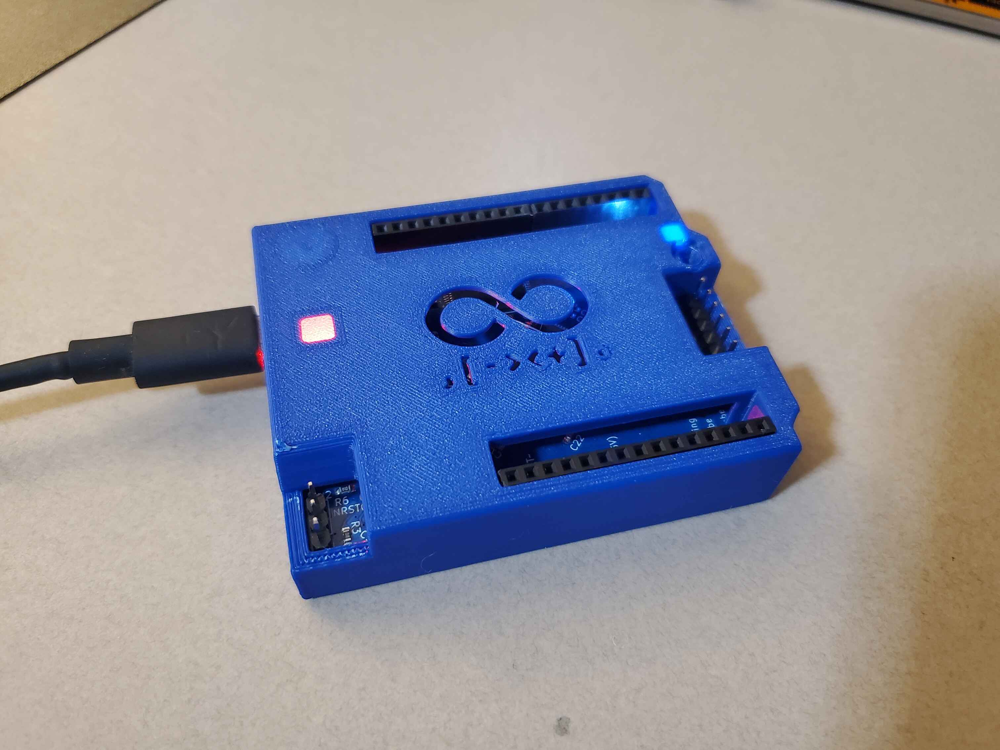

# 3D Printable Case & Assembly

To protect your Brainfuino and make it portable on the go, a custom enclosure was designed specifically for the **Rev 1.1** PCB layout. Rather than a fragile snap-fit, the case features an integrated retaining hook on one side and secures firmly with a single screw fastener on the opposite side.

The CAD design files reside under [`3D-printable-case/`](https://github.com/m-archibald/Brainfuino/tree/main/3D-printable-case):

* `BrainFuinoCase.SLDPRT` (Native SolidWorks model)
* `BrainFuinoCase.STEP` (Standard STEP format for FreeCAD, Fusion 360, Onshape, or your slicer)

---

## Required Hardware

You only need two standard metric fasteners:

| Item | Quantity | Notes |
| :--- | :---: | :--- |
| **M3 × 14mm Socket Head Bolt** | 1 | Secures the case halves together. Longer screws (e.g. 16mm or 20mm) work fine too—simply add washers under the head or trim the screw shorter. |
| **M3 Hex Nut** | 1 | Presses into the captured nut pocket in the bottom shell. |

---

## 3D Printing Guidelines

The enclosure is optimized for FDM (Fused Deposition Modeling) 3D printers with standard 0.4 mm nozzles.

| Slicer Setting | Recommended Value | Notes |
| :--- | :--- | :--- |
| **Material** | PLA, PETG, or ABS | PLA gives crisp dimensional accuracy; PETG provides durability. |
| **Layer Height** | 0.20 mm | 0.16 mm or 0.20 mm recommended for smooth overhangs. |
| **Infill** | 15% – 25% | Gyroid or Grid infill pattern. |
| **Walls / Perimeters** | 3 or 4 | Ensures rigid screw holes and corners. |
| **Supports** | None needed | Designed to print cleanly flat-down on the build plate. |
| **Brim** | Optional | Helpful for sharp bed corners if printing with PETG/ABS. |

---

## Assembly Overview

Assembly takes less than a minute with only a single M3 bolt:

1. **Insert M3 Nut:** Press the **M3 nut** into the captive hexagonal pocket in the bottom shell.
2. **Seat the PCB:** Place the Brainfuino PCB into the bottom shell, aligning the USB-C port with its cutout.
3. **Hook the Retention Tab:** Hook the retaining tab on one side of the top lid into the slot on the bottom shell, then swing the lid closed over the board.
4. **Fasten M3 Bolt:** Insert the **M3 × 14mm bolt** into the single mounting hole and tighten until snug.

*Exploded view showing top lid with retention hook, bottom shell with Brainfuino PCB seated, and single M3 mounting screw with washer.*

---

## Enclosure Details & Cutouts

The enclosure includes dedicated cutouts so all programming headers, debug jumpers, and buses remain accessible without opening the case:

-   

    ---

    **BOOT0 & Reset Jumper Notch**
    
    A recessed corner notch provides instant access to the STM32 `BOOT0` jumper and `NRST` header for entering DFU bootloader mode.

-   

    ---

    **Single Fastener Retention**
    
    The top lid hooks securely on one edge and locks down with a single M3 socket bolt and washer on the opposite corner.

-   

    ---

    **JTAG & Shield Header Access**
    
    Recessed openings expose the 6-pin FPGA JTAG programming header (`VCC`, `TCK`, `TMS`, `TDI`, `TDO`, `GND`) and standard Arduino Uno pin headers.

-   

    ---

    **Status LED Illumination**
    
    Translucent cutouts illuminate the infinity Brainfuino logo `[ - > < + ] .` and display red power and blue FPGA clock activity LEDs.

