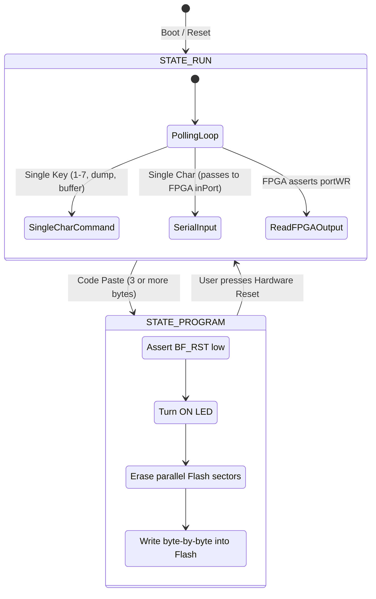

# STM32 Coprocessor Firmware Architecture

The **STM32F072V8T6** acts as the executive companion to the FPGA soft-processor. While the FPGA executes Brainfuck code, the STM32 manages everything outside the CPU core:

1. Synthesizing system clock pulses.
2. Managing USB communications and CDC virtual serial port emulation.
3. Controlling reset lines and programming parallel ROM with new Brainfuck code.
4. Relaying characters between the terminal and the FPGA.
5. Sampling analog voltages via its internal 12-bit ADC.

---

## State Machine Overview

The firmware implements two primary operational states:

---

## Clock Generation (`set_freq`)

The STM32 features a programmable timer configured as a square-wave generator driving the FPGA clock input pin (`BF_CLK`). 

Users can toggle clock frequencies on the fly from the terminal without recompiling code:

--8<-- "snippets/clock-speeds.md"

---

## Flash ROM Programming

The 256 kB Flash memory chip (`SST39LF020`) has its control and address pins shared between the FPGA and the STM32:

1. **Isolation:** When `STATE_PROGRAM` is active, the STM32 pulls the FPGA reset line low (`BF_RST = 0`). This places the FPGA's 18-bit program counter lines into high impedance (`assign pc_pins = (reset) ? pc : 18'bzz...`), releasing the ROM address bus.
2. **Erase Cycle:** The STM32 executes the Flash chip's sector erase command sequence.
3. **Byte Programming:** For each byte in the incoming USB packet, the STM32 applies the address, sets the data byte, and pulses the active-low Write Enable (`WE`) strobe according to the SST39LF020 timing specifications.
4. **Completion:** The STM32 sends a status message (`Wrote <N> bytes\n`) back through the USB CDC pipe.

---

## USB CDC Virtual Serial Port

The STM32F072 features built-in USB 2.0 Full-Speed hardware with an internal PHY and dedicated crystal-less clock recovery (using ST's Clock Recovery System `CRS`), eliminating the need for an external crystal oscillator.

Incoming serial bytes are processed in `CDC_Receive_Callback()` in `main.c`, while outgoing characters from the FPGA are collected via an interrupt routine and buffered into the CDC transmit endpoint.
