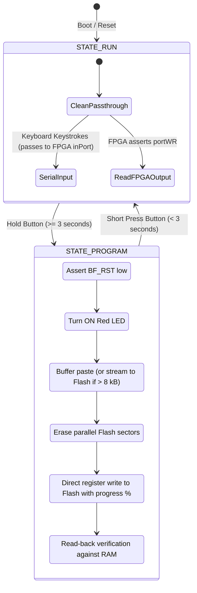

# STM32 Coprocessor Firmware Architecture

The **STM32F072V8T6** acts as the executive companion to the FPGA soft-processor. While the FPGA executes Brainfuck code, the STM32 manages everything outside the CPU core:

1. Synthesizing system clock pulses.
2. Managing USB communications and CDC virtual serial port emulation.
3. Controlling reset lines and programming parallel ROM with new Brainfuck code.
4. Relaying characters between the terminal and the FPGA.
5. Sampling analog voltages via its internal 12-bit ADC.

---

## State Machine Overview

The firmware implements two primary operational states:



---

## Flash ROM Programming & Streaming Engine

The 256 kB Flash memory chip (`SST39LF020`) has its control and address pins shared between the FPGA and the STM32:

1. **Isolation:** When `STATE_PROGRAM` is active, the STM32 pulls the FPGA reset line low (`BF_RST = 0`). This places the FPGA's 18-bit program counter lines into high impedance (`assign pc_pins = (reset) ? pc : 18'bzz...`), releasing the ROM address bus.
2. **Dual-Mode Flashing Strategy:**
   * **Programs $\le$ 4 kB:** Buffered in internal STM32 SRAM (`prog_buffer`). Once a 100 ms idle timeout elapses, the STM32 erases ROM, programs bytes with live percentage updates, verifies against RAM, appends an endless loop (`[-]+[]`), and auto-launches.
   * **Streaming Engine (> 4 kB up to 256 kB):** When incoming code exceeds 4 kB, the firmware transitions into streaming mode. It erases the Flash chip and writes the initial 4 kB chunk. Subsequent packets are buffered through a circular staging FIFO (`stream_staging`, 1 kB) and continuously written to Flash.
3. **Hardware USB CDC Flow Control (NAK Backpressure):**
   * Parallel Flash erase takes ~20 ms, and byte programming takes ~10 $\mu$s per byte. To prevent host USB buffer overflows during rapid terminal pasting, the firmware implements true hardware flow control at the USB CDC endpoint level.
   * When the staging buffer is near capacity or during Flash erase, `CDC_Receive_Callback` halts endpoint re-arming and sets `cdc_rx_paused = 1`. The STM32 hardware USB engine returns hardware **NAK tokens** to the host PC, pausing host transmissions with zero dropped bytes.
   * As the main execution loop drains the staging FIFO to Flash, `CDC_Resume_Rx()` re-arms the OUT endpoint (`USBD_CDC_ReceivePacket`), smoothly resuming host transmission.
4. **Byte Programming:** Using direct single-cycle register writes (`GPIOE->ODR` for address lines `A0`–`A15` and `GPIOB->ODR` for data lines `D0`–`D7`), the STM32 writes the program to Flash in tens of milliseconds while streaming live percentage progress to the terminal.
5. **Auto-Launch & Termination:** Automatically appends `[-]+[]` to cleanly park the FPGA PC at end-of-program, pulses reset, and auto-launches.

---

## USB CDC Virtual Serial Port & Software DFU Jump

The STM32F072 features built-in USB 2.0 Full-Speed hardware with an internal PHY and dedicated crystal-less clock recovery (using ST's Clock Recovery System `CRS`), eliminating the need for an external crystal oscillator.

Incoming serial bytes are processed in `CDC_Receive_Callback()` in `main.c`, while outgoing characters from the FPGA are collected via an interrupt routine and buffered into the CDC transmit endpoint.

### Software DFU Bootloader Jump Architecture

To eliminate the need for physical jumper manipulation during firmware updates:

1. **Trigger Command:** Receiving the serial token `!DFU!` in `STATE_RUN` sets `dfu_requested = 1`.
2. **Physical USB Disconnect:** In Thread Mode, `Execute_DFU_Jump()` shuts down the USB stack and pulls the USB DP line (`PA12`) LOW for 200 ms. This forces the host operating system to recognize a genuine physical USB disconnection.
3. **SRAM Persistence Flag:** The firmware writes `0xDEADBEEF` to a reserved address at the top of SRAM (`0x20003FF0`) and invokes `NVIC_SystemReset()`.
4. **Startup Intercept:** In `startup_stm32f072v8tx.s`, the very first instructions in `Reset_Handler` inspect `0x20003FF0`. If the magic value is present, the handler clears the flag, re-initializes the Main Stack Pointer (`MSP`) from the ST system ROM vector table at `0x1FFFC800`, and branches directly to the ROM DFU bootloader entry point (`0x1FFFC804`). The board seamlessly re-enumerates as an ST DFU bootloader device.

---

## Smart Hardware Clock-Pausing & Output Throttling

Brainfuino's MachXO2 FPGA soft-processor executes Brainfuck instructions in parallel without hardware wait-states. At high frequencies, output instructions (`.`) hold data on the bus for only 20 clock cycles ($1.66\ \mu\text{s}$ at 12 MHz). Closely-spaced prints (e.g. `\r\n` line endings in Mandelbrot or ASCII banner loops) would outpace Cortex-M0 interrupt latency, causing dropped characters.

To guarantee **100% character fidelity at all speeds**, the firmware implements a hardware clock-pausing mechanism:

1. **Falling-Edge Strobe Detection:** `BF_OUTSTRB` (`PC3`) is configured in `GPIO_MODE_IT_FALLING`. When `portWR` drops LOW, data on `PB0`–`PB7` has already settled for 20 clock cycles, catching the FPGA at the start of its output hold window.
2. **Instant Hardware Clock Gating:** The very first assembly instruction inside `EXTI2_3_IRQHandler` gates the STM32's MCO output on `PA8`:
   ```c
   RCC->CFGR &= ~RCC_CFGR_MCO;  // 1 CPU cycle hardware freeze
   ```
   This instantly suspends the FPGA master clock, freezing the soft-processor with the output byte held static on the bus.
3. **Trace Settle & Bus Latch:** Two `__NOP()` cycles allow all PCB trace line skews to settle completely. The STM32 reads `(uint8_t)GPIOB->IDR` directly from register memory.
4. **Buffer Backpressure & Resume:**
   * If the USB circular queue has capacity, the clock is resumed in the same interrupt (`~200 ns` total pause).
   * If the USB circular queue is near capacity (`used >= OUTBOX_CAPACITY - 8`), `mco_throttled = 1` keeps the FPGA clock suspended until the USB endpoint transmits a packet and the queue drains below 50%.

---

## 13-Speed Frequency Ladder & Parallel ROM Timing

The clock fed to the FPGA is synthesized by the STM32's Microcontroller Clock Output (`MCO`) pin `PA8`. The firmware exposes a granular 13-speed table:

| Idx | Frequency | Clock Source & Divisor | Cycle Period | ROM Access Margin vs $55\text{ ns}$ |
| :---: | :--- | :--- | :--- | :--- |
| `1` | **62.5 kHz** | HSI (8 MHz) / 128 | $16.0\ \mu\text{s}$ | $+15,936\text{ ns}$ (Safe) |
| `2` | **125 kHz** | HSI (8 MHz) / 64 | $8.0\ \mu\text{s}$ | $+7,936\text{ ns}$ (Safe) |
| `3` | **250 kHz** | HSI (8 MHz) / 32 | $4.0\ \mu\text{s}$ | $+3,936\text{ ns}$ (Safe) |
| `4` | **500 kHz** | HSI (8 MHz) / 16 | $2.0\ \mu\text{s}$ | $+1,936\text{ ns}$ (Default) |
| `5` | **750 kHz** | HSI48 (48 MHz) / 64 | $1.33\ \mu\text{s}$ | $+1,270\text{ ns}$ (Safe) |
| `6` | **1 MHz** | HSI (8 MHz) / 8 | $1.0\ \mu\text{s}$ | $+936\text{ ns}$ (Safe) |
| `7` | **1.5 MHz** | HSI48 (48 MHz) / 32 | $666.7\text{ ns}$ | $+603\text{ ns}$ (Safe) |
| `8` | **2 MHz** | HSI (8 MHz) / 4 | $500.0\text{ ns}$ | $+436\text{ ns}$ (Safe) |
| `9` | **3 MHz** | HSI48 (48 MHz) / 16 | $333.3\text{ ns}$ | $+270\text{ ns}$ (Safe) |
| `10` | **4 MHz** | HSI (8 MHz) / 2 | $250.0\text{ ns}$ | $+186\text{ ns}$ (Safe) |
| `11` | **6 MHz** | HSI48 (48 MHz) / 8 | $166.7\text{ ns}$ | $+103\text{ ns}$ (Safe) |
| `12` | **8 MHz** | HSI (8 MHz) / 1 | $125.0\text{ ns}$ | $+61.5\text{ ns}$ (Safe) |
| `13` | **12 MHz** | HSI48 (48 MHz) / 4 | $83.3\text{ ns}$ | $+28.3\text{ ns}$ (**Maximum Safe Speed**) |

### The 55 ns Physical Silicon Ceiling
The parallel NOR Flash on Brainfuino is the `SST39LF020-55-4C-WHE` ($T_{AA} = 55\text{ ns}$). Because the MachXO2 fetches instructions in a single cycle without wait-states:
$$F_{\text{max}} = \frac{1}{T_{AA} + T_{co} + T_{su} + 2\cdot T_{\text{trace}}} \approx \frac{1}{55\text{ ns} + 8.5\text{ ns}} \approx 15.75\text{ MHz}$$
Speeds above 12 MHz (such as 24 MHz at $41.6\text{ ns}$ or 48 MHz at $20.8\text{ ns}$) physically violate the Flash access time, causing un-waitstated fetches to fail. **12 MHz** is the highest divider that provides positive timing margin ($+28.3\text{ ns}$) and delivers 100% character fidelity.

---

## Non-Volatile Flash Configuration Persistence

Configuration menu preferences (active clock frequency, auto-program on paste, upload threshold, auto-reset, endless loop injection, and run mode speed hotkeys) are preserved across power cycles:

* **Flash Emulation Sector:** Stored in the top 2 kB page of the STM32F072's internal Flash memory: Page 63 (`0x0801F800` – `0x0801FFFF`), located above application code.
* **Integrity Validation:** Validated via a 32-bit magic word (`0xBF072C01`) and an additive checksum. If the page is unwritten or corrupted, safe defaults are loaded.
* **Flash Wear Mitigation:** An in-memory cache check verifies whether current settings differ from Flash contents before erasing or programming, minimizing erase cycles.
* **Seamless Boot Restoration:** `settings_load()` executes during system initialization before `state = STATE_RUN`, guaranteeing the user's preferred clock speed and settings apply immediately on power-up.

