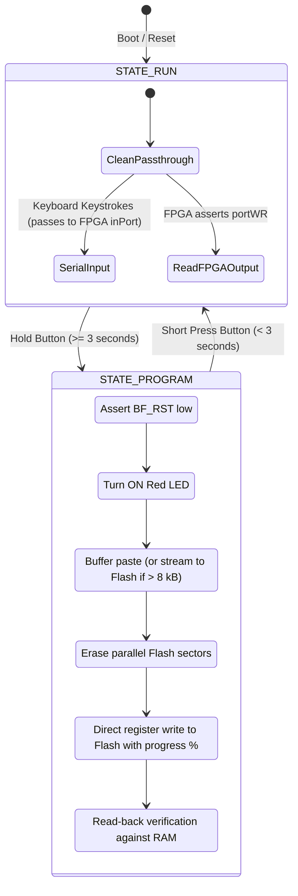

# STM32 Coprocessor Firmware Architecture

The **STM32F072V8T6** acts as the executive companion to the FPGA soft-processor. While the FPGA executes Brainfuck code, the STM32 manages everything outside the CPU core:

1. Synthesizing system clock pulses.
2. Managing USB communications and CDC virtual serial port emulation.
3. Controlling reset lines and programming parallel ROM with new Brainfuck code.
4. Relaying characters between the terminal and the FPGA.
5. Sampling analog voltages via its internal 12-bit ADC.

---

## State Machine Overview

The firmware implements two primary operational states:

---

## Flash ROM Programming & Streaming Engine

The 256 kB Flash memory chip (`SST39LF020`) has its control and address pins shared between the FPGA and the STM32:

1. **Isolation:** When `STATE_PROGRAM` is active, the STM32 pulls the FPGA reset line low (`BF_RST = 0`). This places the FPGA's 18-bit program counter lines into high impedance (`assign pc_pins = (reset) ? pc : 18'bzz...`), releasing the ROM address bus.
2. **Dual-Mode Flashing Strategy:**
   * **Programs $\le$ 4 kB:** Buffered in internal STM32 SRAM (`prog_buffer`). Once a 100 ms idle timeout elapses, the STM32 erases ROM, programs bytes with live percentage updates, verifies against RAM, appends an endless loop (`[-]+[]`), and auto-launches.
   * **Streaming Engine (> 4 kB up to 256 kB):** When incoming code exceeds 4 kB, the firmware transitions into streaming mode. It erases the Flash chip and writes the initial 4 kB chunk. Subsequent packets are buffered through a circular staging FIFO (`stream_staging`, 1 kB) and continuously written to Flash.
3. **Hardware USB CDC Flow Control (NAK Backpressure):**
   * Parallel Flash erase takes ~20 ms, and byte programming takes ~10 $\mu$s per byte. To prevent host USB buffer overflows during rapid terminal pasting, the firmware implements true hardware flow control at the USB CDC endpoint level.
   * When the staging buffer is near capacity or during Flash erase, `CDC_Receive_Callback` halts endpoint re-arming and sets `cdc_rx_paused = 1`. The STM32 hardware USB engine returns hardware **NAK tokens** to the host PC, pausing host transmissions with zero dropped bytes.
   * As the main execution loop drains the staging FIFO to Flash, `CDC_Resume_Rx()` re-arms the OUT endpoint (`USBD_CDC_ReceivePacket`), smoothly resuming host transmission.
4. **Byte Programming:** Using direct single-cycle register writes (`GPIOE->ODR` for address lines `A0`–`A15` and `GPIOB->ODR` for data lines `D0`–`D7`), the STM32 writes the program to Flash in tens of milliseconds while streaming live percentage progress to the terminal.
5. **Auto-Launch & Termination:** Automatically appends `[-]+[]` to cleanly park the FPGA PC at end-of-program, pulses reset, and auto-launches.

---

## USB CDC Virtual Serial Port & Software DFU Jump

The STM32F072 features built-in USB 2.0 Full-Speed hardware with an internal PHY and dedicated crystal-less clock recovery (using ST's Clock Recovery System `CRS`), eliminating the need for an external crystal oscillator.

Incoming serial bytes are processed in `CDC_Receive_Callback()` in `main.c`, while outgoing characters from the FPGA are collected via an interrupt routine and buffered into the CDC transmit endpoint.

### Software DFU Bootloader Jump Architecture

To eliminate the need for physical jumper manipulation during firmware updates:

1. **Trigger Command:** Receiving the serial token `!DFU!` in `STATE_RUN` sets `dfu_requested = 1`.
2. **Physical USB Disconnect:** In Thread Mode, `Execute_DFU_Jump()` shuts down the USB stack and pulls the USB DP line (`PA12`) LOW for 200 ms. This forces the host operating system to recognize a genuine physical USB disconnection.
3. **SRAM Persistence Flag:** The firmware writes `0xDEADBEEF` to a reserved address at the top of SRAM (`0x20003FF0`) and invokes `NVIC_SystemReset()`.
4. **Startup Intercept:** In `startup_stm32f072v8tx.s`, the very first instructions in `Reset_Handler` inspect `0x20003FF0`. If the magic value is present, the handler clears the flag, re-initializes the Main Stack Pointer (`MSP`) from the ST system ROM vector table at `0x1FFFC800`, and branches directly to the ROM DFU bootloader entry point (`0x1FFFC804`). The board seamlessly re-enumerates as an ST DFU bootloader device.
