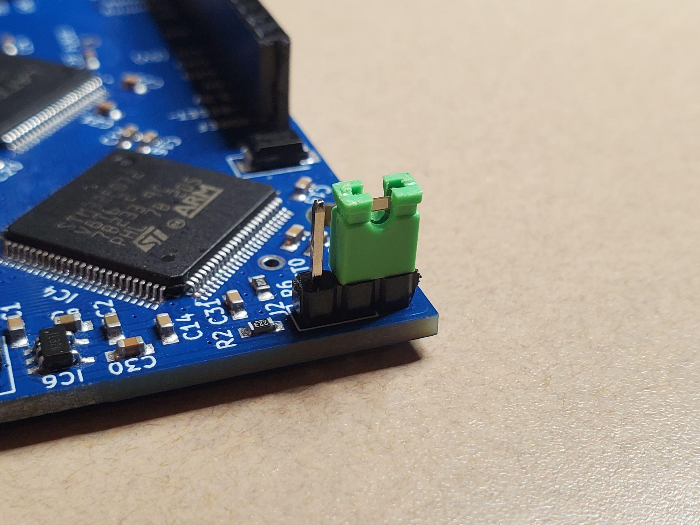
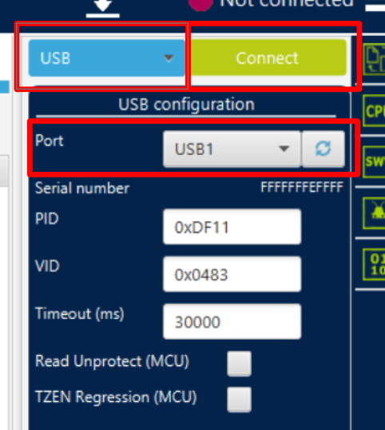
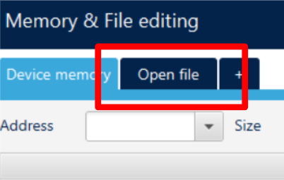
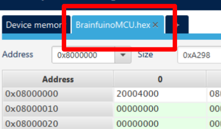
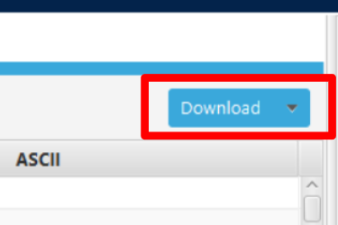
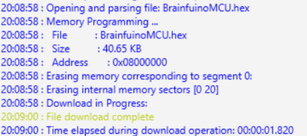

# Building & Flashing STM32 Firmware

The companion MCU firmware is organized as an **STM32CubeIDE** project located under [`companion-STM32-firmware/`](https://github.com/m-archibald/Brainfuino/tree/main/companion-STM32-firmware).

A pre-built production binary is always kept ready at:
[`companion-STM32-firmware/Debug/BrainfuinoMCU.hex`](https://github.com/m-archibald/Brainfuino/blob/main/companion-STM32-firmware/Debug/BrainfuinoMCU.hex).

---

## Toolchain Setup

To modify or rebuild the firmware:

1. Download and install [STM32CubeIDE](https://www.st.com/en/development-tools/stm32cubeide.html) (free from STMicroelectronics, cross-platform for Windows, Linux, and macOS).
2. Launch STM32CubeIDE and select your workspace directory.
3. Go to **File → Import → General → Existing Projects into Workspace**.
4. Browse to the root of `companion-STM32-firmware/` and click **Finish**.

---

## Rebuilding the Project

1. In the Project Explorer, right-click `BrainfuinoMCU`.
2. Select **Build Project** (or press ++ctrl+b++ / ++cmd+b++).
3. The GCC ARM toolchain compiles the STM32 HAL drivers, USB Device library, and `main.c`.
4. The output `.elf`, `.bin`, and `.hex` files are generated in the `Debug/` folder.

---

## Flashing the Microcontroller

There are two methods to flash the firmware onto the STM32F072:

### Method 1: Via Built-in USB DFU (Recommended)

The STM32F072 features a factory-programmed USB DFU (Device Firmware Upgrade) bootloader residing in permanent system ROM. **No external hardware programmer is required!**

You can flash using either **STM32CubeIDE** or the standalone lightweight **[STM32CubeProgrammer](https://www.st.com/en/development-tools/stm32cubeprog.html)** utility (ideal if you only want to update the binary without installing the full IDE).

1. **Set DFU Mode:**
    * Place the jumper into the **BOOT** position (pulls `BOOT0` HIGH to 3.3V).
    
    

2. **Connect Hardware:**
    * Connect the Brainfuino to your computer using a **USB-C data cable**.

3. **Connect in STM32CubeProgrammer:**
    * Launch **STM32CubeProgrammer**.
    * In the top-right connection panel, select **USB** from the drop-down menu, verify that **Port USB1** appears (click the refresh icon if needed), and click **Connect**.
    
    

4. **Open the Firmware Binary:**
    * Click the **Open file** tab in the top bar:
    
    
    
    * Browse and select `BrainfuinoMCU.hex` (found under `companion-STM32-firmware/Debug/` or downloaded from the GitHub release).
    * The **BrainfuinoMCU.hex** tab will load, showing the firmware mapped to starting flash address `0x08000000`:
    
    

5. **Download & Flash Firmware:**
    * Click the blue **Download** button:
    
    
    
    * The programmer will erase sectors and write the firmware. Verify the console displays **File download complete**:
    
    

6. **Return to Run Mode:**
    * Unplug the board, move the `BOOT` jumper back so the STM32 can boot normally, and plug the USB-C cable back in.
    * The STM32 coprocessor is now fully programmed and ready to run!

---

### Method 2: Via ST-Link Programmer (Hardware Debugging)

If you are actively developing code and want live breakpoints, variable watches, and hardware stepping:

1. Connect an ST-Link v2 or v3 programmer to the 4-pin SWD header:
    * Pins: `SWDIO`, `SWCLK`, `GND`, `3.3V`
2. In STM32CubeIDE, click **Run → Debug** (or click the Bug icon).
3. The IDE will connect over SWD, flash the firmware into Flash memory, and pause execution at `main()`.
