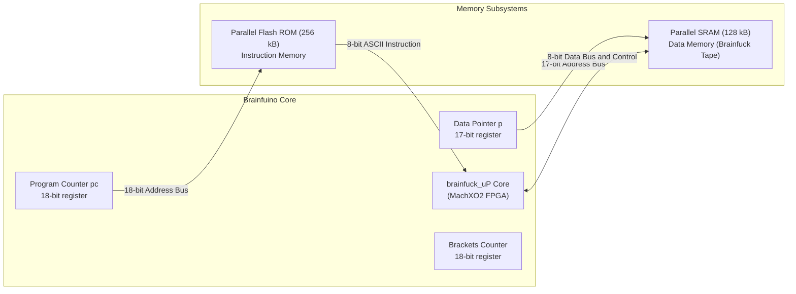

# FPGA Soft-Processor Architecture

At the heart of the Brainfuino lies **`brainfuck_uP`**, a custom soft-processor core designed in Verilog by Eduardo Corpeño and synthesized for the **Lattice MachXO2-640HC** FPGA.

Unlike general-purpose microprocessors that require an instruction set architecture (ISA) decoding binary opcodes into ALU control signals, `brainfuck_uP` natively interprets **raw ASCII characters** directly in hardware.

---

## Harvard Memory Model

The architecture features strict separation between code and data memories:



* **Instruction Memory (ROM):**
    * **Size:** 256 kB (Addresses `0x00000` to `0x3FFFF`).
    * **Bus:** 18-bit unidirectional address bus (`pc_pins[17:0]`), 8-bit instruction bus.
    * **Contents:** The raw Brainfuck source file, stored as ASCII text.
* **Data Memory (RAM):**
    * **Size:** 128 kB (Addresses `0x00000` to `0x1FFFF`).
    * **Bus:** 17-bit address bus (`p[16:0]`), 8-bit bidirectional data bus (`pData[7:0]`), with active-low Read (`RD`) and Write (`WR`) strobes.
    * **Contents:** The Brainfuck memory tape, initialized to zeroes at boot.

---

## Native ASCII Instruction Decoder

In the Verilog source code, the processor state machine matches incoming bytes directly against ASCII character literals:

```verilog
case (instruction)
    "+": begin ... end // Increment current memory cell
    "-": begin ... end // Decrement current memory cell
    ">": begin ... end // Increment data pointer (p <= p + 1)
    "<": begin ... end // Decrement data pointer (p <= p - 1)
    ".": begin ... end // Output character from current memory cell
    ",": begin ... end // Wait for incoming character and store in memory
    "[": begin ... end // Jump forward to matching ']' if *p == 0
    "]": begin ... end // Jump backward to matching '[' if *p != 0
    default: begin
        // Any character other than the 8 Brainfuck commands
        // is treated as a comment / NOP!
        pc <= pc + 8'd1;
    end
endcase
```

Because all non-Brainfuck characters hit the `default` branch and simply advance the Program Counter (`pc <= pc + 1`), you can freely include whitespace, tabs, newlines, and comments directly inside your Brainfuck source files!

---

## State Machine Execution Flow & One-Hot Encoding

The processor is orchestrated by a 7-state finite state machine (FSM). 

### What is "One-Hot" Encoding?

In software or simple microcontroller firmware, state machines often use an integer counter:
* State 0 = `3'b000`
* State 1 = `3'b001`
* State 2 = `3'b010` ... up to State 6 = `3'b110`.

While binary encoding saves bits (only 3 bits for 7 states), inside an FPGA it is suboptimal because every state transition requires combinational logic gates (AND, OR, NOT) to decode the binary pattern.

In an FPGA, flip-flops are physically integrated into every logic slice and are effectively "free." **One-hot encoding** allocates a dedicated flip-flop to each individual state. Exactly **one** flip-flop is active (`1` or "hot") at any given moment:

```verilog
`define STATE_0 7'b0000001
`define STATE_1 7'b0000010
`define STATE_2 7'b0000100
`define STATE_3 7'b0001000
`define STATE_4 7'b0010000
`define STATE_5 7'b0100000
`define BOOT_UP 7'b1000000
```

**Advantages of One-Hot in FPGAs:**
1. **Blazing Speed:** Testing if the CPU is in `STATE_0` requires reading a single register bit (`state[0] == 1`). There is zero decoding latency, allowing clock speeds up to **48 MHz**.
2. **Glitch-Free Operation:** In binary encoding, transitioning from `001` to `010` can briefly pass through `000` or `011` due to microsecond path delays, causing electrical glitches. One-hot transitions directly and cleanly.
3. **Minimal Logic Depth:** Synthesis tools can implement state transitions using direct multiplexer multiplexing rather than wide Boolean equations.

---

### Detailed State-by-State Execution

| State | Purpose | Description & Actions |
| :--- | :--- | :--- |
| `BOOT_UP` | Power-on Initialization | Asserts active-low `WR = 0` to SRAM and counts down an internal `delay` timer to ensure parallel RAM is fully stabilized and zeroed before code execution begins. |
| `STATE_0` | Instruction Fetch & Decode | Evaluates the incoming byte on `instruction`:<br/>• **Pointer moves (`<`, `>`):** Execute in a **single clock cycle** (`p <= p ± 1; pc <= pc + 1;`).<br/>• **Arithmetic (`+`, `-`):** Latches memory byte into accumulator `acc <= pData ± 1`, stages `RD <= 1`, and advances to `STATE_1`.<br/>• **Input (`,`):** Waits for `incoming == 1`, latches `inPort`, and moves to `STATE_1`.<br/>• **Output (`.`):** Latches `outPort <= pData` and moves to `STATE_1`.<br/>• **Loops (`[`, `]`):** Checks `pData` condition. If jump needed, stages `brackets <= 1` and moves to `STATE_5`. |
| `STATE_1` | Memory & Strobe Staging | Drives or samples the bidirectional RAM data bus (`pData`). Stages port read/write strobes (`portRD`, `portWR`). |
| `STATE_2` | Active Strobe Assertion | Asserts active read/write strobes (`WR <= 0` or `RD <= 0`, `portRD <= 0`, `portWR <= 0`) to initiate physical memory latching. |
| `STATE_3` | Strobe Hold Time | Enforces the minimum write pulse width and hold times required by the `CY62128` SRAM datasheet. |
| `STATE_4` | Writeback & PC Increment | Completes the memory write cycle, sets `WR <= 1`, increments the program counter (`pc <= pc + 1`), and returns cleanly to `STATE_0` for the next instruction. |
| `STATE_5` | Bracket Nesting Search | Multi-cycle seek state. Scans forward or backward through ROM instruction-by-instruction, incrementing/decrementing `brackets` until finding the matching pair. |

---

## Hardware Bracket Matching (`[` and `]`)

Handling nested loops in hardware is typically challenging. `brainfuck_uP` achieves this using a dedicated **18-bit bracket nesting counter** (`reg [17:0] brackets`) and a direction flag (`reg FWD`):

1. **Loop Entry (`[`):**
    * If the current memory cell `pData == 0`, the loop must be skipped.
    * The processor sets `FWD = 1`, initializes `brackets = 1`, and enters `STATE_5`.
    * In `STATE_5`, the PC advances byte-by-byte:
        * If another `[` is encountered: `brackets <= brackets + 1`
        * If a `]` is encountered: `brackets <= brackets - 1`
    * When `brackets == 0`, the matching closing bracket has been found, and normal execution resumes.
2. **Loop Exit (`]`):**
    * If `pData != 0`, execution must jump back to the loop header.
    * The processor sets `FWD = 0`, sets `brackets = 1`, and steps the PC backward (`pc <= pc - 1`) in `STATE_5` until the corresponding `[` is located.

Because the counter is 18 bits wide, the processor supports loops nested up to **262,143 levels deep**—vastly exceeding any practical Brainfuck program!

---

## Roadmap: Flashing the FPGA Through the STM32

??? info "Technical Feasibility Analysis"
    **Can the STM32 coprocessor flash the Lattice MachXO2 FPGA directly?**
    
    **Verdict: 100% Technically Feasible!**
    
    ### How It Works
    1. **Dedicated Programming Port:** The Lattice MachXO2 features built-in non-volatile configuration memory (NVCM/Flash) that natively supports **Slave JTAG** and **Slave SPI (SSPI)** programming modes.
    2. **Lattice Embedded C Engines:** Lattice provides open-source reference implementations (**`embedded_jtag`** and **`ispVM Embedded`**) written in portable C specifically designed for microcontrollers to program MachXO2 FPGAs from a `.jed` bitstream.
    3. **Hardware Wiring:** If spare GPIO pins on the STM32F072 are bridged to the MachXO2 JTAG header (`TCK`, `TMS`, `TDI`, `TDO`) or SPI pins, the STM32 can clock and shift the programming algorithms directly into the FPGA.
    
    ### What This Enables
    When implemented, Brainfuino users will never need an external JTAG programmer or FTDI cable to update the FPGA soft-processor. A user will simply be able to drag-and-drop a new bitstream over USB, and the STM32 will flash the FPGA in-circuit!
    
    *Track progress and related hardware goals on the [Project Roadmap](../roadmap.md#in-circuit-fpga-flashing-via-stm32-high-interest).*
