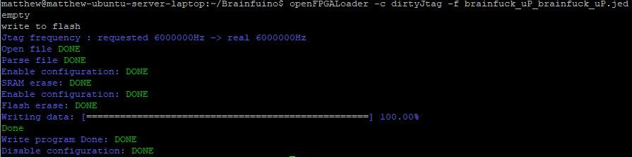

# DIY JTAG Programming with DirtyJTAG & openFPGALoader

You do not need an expensive proprietary ($300) Lattice hardware programmer to flash the Brainfuino. Any open-source or commercial JTAG adapter supported by **[openFPGALoader](https://trabucayre.github.io/openFPGALoader/compatibility/cable.html)** will work!

If you don't already own a dedicated JTAG debugger, you can turn a low-cost microcontroller board into a high-speed JTAG programmer using **DirtyJTAG**.

---

## Choosing a DIY JTAG Adapter

| Adapter Option | Typical Cost | Setup Complexity | Notes |
| :--- | :---: | :--- | :--- |
| **Raspberry Pi Pico** | ~$4 | **Extremely Easy (Recommended)** | Just drag-and-drop a `.UF2` firmware file onto the Pico over USB. |
| **STM32F103 "Blue Pill"** | ~$3 | Easy | Requires flashing firmware onto the Blue Pill using an ST-Link (~$6). |
| **FTDI / Commercial JTAG** | $10 – $30 | None | Directly supported by openFPGALoader out of the box. |

---

## 1. Setting Up the DirtyJTAG Firmware

### Option A: Raspberry Pi Pico (Recommended)
1. Download the pre-built `.UF2` firmware from the **[pico-dirtyJtag releases page](https://github.com/phdussud/pico-dirtyJtag/releases/tag/V1.07)**.
2. Hold down the `BOOTSEL` button on your Raspberry Pi Pico and plug it into your computer via USB.
3. Drag and drop the downloaded `.UF2` file onto the `RPI-RP2` mass storage drive.
4. The Pico will reboot automatically as an open-source DirtyJTAG programmer!

### Option B: STM32F103 "Blue Pill"
Follow the official **[DirtyJTAG Blue Pill installation guide](https://github.com/dirtyjtag/DirtyJTAG/blob/master/docs/install-bluepill.md)** to flash the firmware using an ST-Link programmer.

---

## 2. JTAG Header Wiring

Connect the jumper wires from your DirtyJTAG adapter to the 6-pin JTAG header on the Brainfuino:

| Signal | Brainfuino JTAG Pin | Pi Pico Default Pin | Description |
| :--- | :---: | :---: | :--- |
| **TCK** | Pin 1 | GP2 | Test Clock |
| **TMS** | Pin 2 | GP3 | Test Mode Select |
| **TDI** | Pin 3 | GP4 | Test Data In |
| **TDO** | Pin 4 | GP5 | Test Data Out |
| **GND** | Pin 5 | GND | Common Ground |
| **3.3V** | Pin 6 | 3V3 | Sense / Power |

---

## 3. Flashing with openFPGALoader (Linux)

This flashing method runs on Linux (e.g. Ubuntu / Debian):

### Install openFPGALoader
```bash
sudo apt update && sudo apt install openFPGALoader
```

*(For other Linux distributions or building from source, see the [openFPGALoader documentation](https://trabucayre.github.io/openFPGALoader/)).*

### Program the MachXO2 Bitstream
1. Obtain the compiled `.jed` bitstream file (`brainfuck_uP_brainfuck_uP.jed`).
2. Plug your DirtyJTAG programmer into your USB port and connect the JTAG wires to the Brainfuino.
3. Run the following command:

```bash
openFPGALoader -c dirtyJtag -f brainfuck_uP_brainfuck_uP.jed
```

*(If you are using a different programmer cable, replace `dirtyJtag` with your cable type, e.g. `ft2232`, `ft232RL`, etc.)*

### Verification

The utility will detect the MachXO2 FPGA, erase Flash, and stream the bitstream:



```text
write to flash
Jtag frequency : requested 60000000Hz -> real 60000000Hz
Open file DONE
Parse file DONE
Enable configuration: DONE
SRAM erase: DONE
Enable configuration: DONE
Flash erase: DONE
Writing data: [==================================================] 100.00%
Done
Write program Done: DONE
Disable configuration: DONE
```

Once you see `Disable configuration: DONE`, the FPGA is permanently programmed and ready to run!
