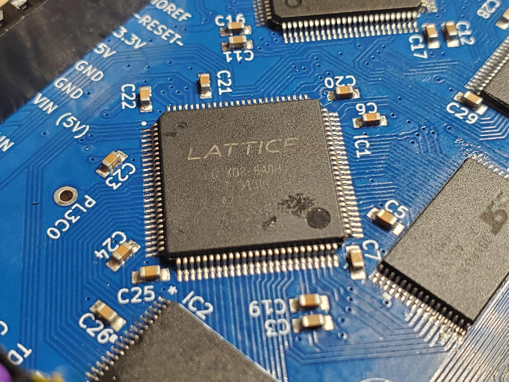
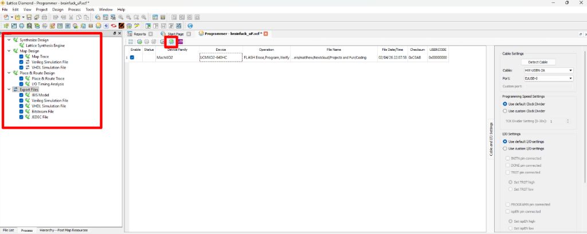

# FPGA Toolchain & Bitstream Generation

The FPGA project is built using **Lattice Diamond**, the official development environment for Lattice MachXO2 devices.

The source files and project configuration reside in [`brainfuck_uP-FPGA-softprocessor/`](https://github.com/m-archibald/Brainfuino/tree/main/brainfuck_uP-FPGA-softprocessor).

---

## Toolchain Requirements

* **Software:** [Lattice Diamond](https://www.latticesemi.com/latticediamond) (v3.11 or newer recommended).
* **License:** Lattice Diamond Free Node-Locked License (available free from Lattice Semiconductor).
* **Hardware Programmer:** Lattice HW-USBN-2A USB programmer, an FTDI-based JTAG cable, or a Raspberry Pi Pico running DirtyJTAG.

---

## Project Structure

Within `brainfuck_uP-FPGA-softprocessor/`:

* `brainfuck_uP.ldf`: The main Lattice Diamond project file.
* `brainfuck_uP.lpf`: Logical Preference File (pin assignments, I/O standards, and timing constraints).
* `brainfuck_uP/brainfuck_uP.xcf`: Pre-configured Lattice Programmer session file.
* `brainfuck_uP/source/brainfuck_uP.v`: The top-level Verilog module describing the CPU core, state machine, and memory buses.
* `brainfuck_uP/source/memory.v`: Memory interface simulation model.
* `brainfuck_uP/source/testing_brainfuck_uP.v`: Testbench harness for logic verification.

---

## Building the Bitstream (`.jed`)

1. Open **Lattice Diamond**.

2. Go to **File → Open → Project** and select `brainfuck_uP.ldf`.

3. In the **Process View** pane, verify the active target device parameters:
    * **Family:** MachXO2
    * **Device:** `LCMXO2-640HC`
    * **Package:** `TG100` (TQFP-100)
    * **Speed Grade:** `4`
    * **Synthesis Tool:** Lattice Synthesis Engine (`LSE`)

4. Verify that `brainfuck_uP.lpf` is the active constraint file.

5. In the Process pane, expand **Export Files** and check the box next to **JEDEC File** (or right-click and click **Run**).

6. Lattice Diamond will automatically execute the complete build flow:
    * **Synthesize Design (LSE):** Parses Verilog and synthesizes gates into MachXO2 LUT primitives.
    * **Translate Design (NGDBuild):** Merges primitives and constraints.
    * **Map Design:** Maps logic to physical slices, I/O banks, and clock trees.
    * **Place & Route Design (PAR):** Optimizes trace routes and checks timing limits.
    * **Generate JEDEC File:** Produces `brainfuck_uP/brainfuck_uP_brainfuck_uP.jed`.

---

## Flashing the MachXO2 FPGA

The Lattice MachXO2 features onboard non-volatile Flash configuration memory, meaning it retains its bitstream permanently across power cycles.

1. Connect your JTAG programmer to the 6-pin JTAG header on the Brainfuino board:
    * Pins: `TCK`, `TMS`, `TDI`, `TDO`, `GND`, `3.3V`

2. In Lattice Diamond, go to **Tools → Programmer** (or open the pre-configured project file `brainfuck_uP/brainfuck_uP.xcf`).

3. In Programmer:
    * Click **Detect Cable** and select your connected USB programmer.
    * Click **Scan** to detect the connected `LCMXO2-640HC` device.

4. Ensure the device operation is configured as:
    * **Access Mode:** `Flash Programming Mode`
    * **Operation:** `FLASH Erase,Program,Verify`
    * **File:** Browse to `brainfuck_uP/brainfuck_uP_brainfuck_uP.jed`

5. Click **Program** (the green icon) in the toolbar.

    

6. Once the status bar turns green (**PASS**), the FPGA is configured and ready to execute native Brainfuck!
