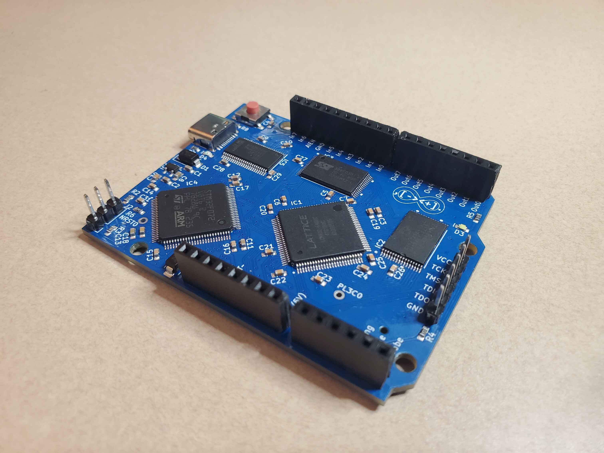
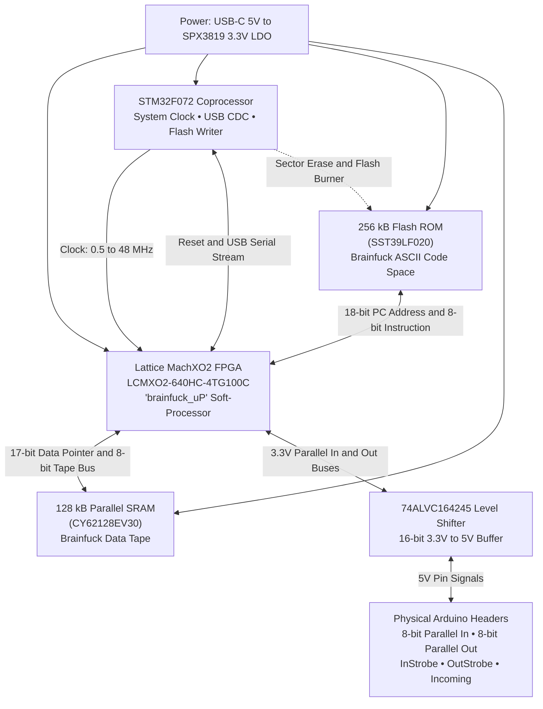
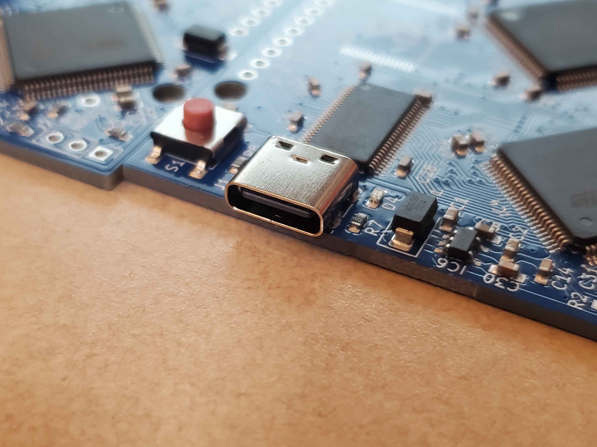
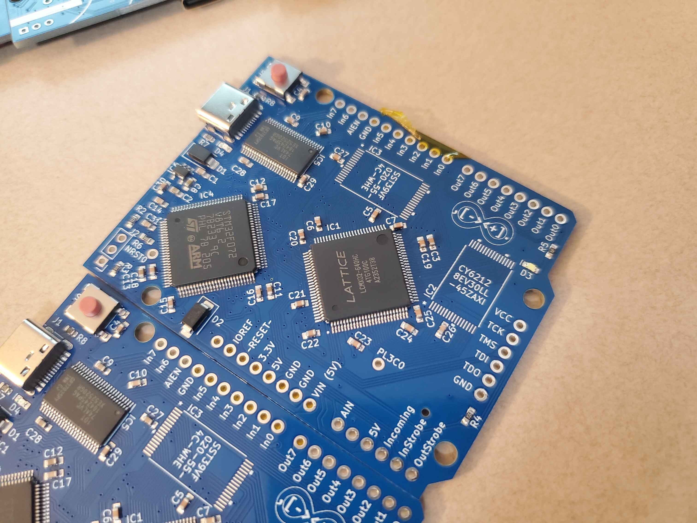
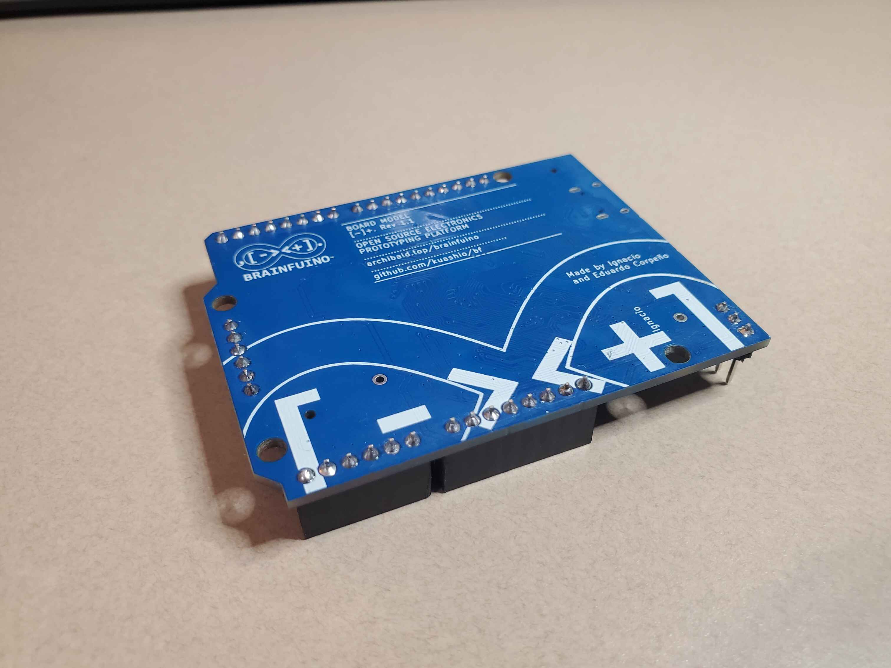

# Hardware Architecture & Specifications

The Brainfuino is engineered in the classic **Arduino Uno form factor**. Why? Mostly for the fun and comedy of having an Arduino-compatible board that runs Brainfuck in native silicon! 

*The Brainfuino Rev 1.1 hardware: featuring the Lattice MachXO2 FPGA, STM32F072 coprocessor, parallel SRAM/ROM, and Arduino Uno-compatible shield headers.*

While standard Arduino shields can physically plug into the headers ("if you really like pain, lol"), the pin definitions are customized to support Brainfuino's native **8-bit parallel I/O buses**.

---

## The Center of the Machine: Lattice MachXO2

Architecturally, the **Lattice MachXO2 FPGA is the absolute center of the universe**. All other subsystems—Flash memory, SRAM, level translators, and the STM32 coprocessor—exist entirely to serve the FPGA's execution pipeline:

---

## Bill of Materials (Core Silicon)

| Designator | Part Number | Package | Role |
| :--- | :--- | :--- | :--- |
| **IC1** | `LCMXO2-640HC-4TG100C` | TQFP-100 | **Lattice MachXO2 FPGA**: Hosts the `brainfuck_uP` processor state machine. |
| **IC2** | `CY62128EV30LL-45AXI` | TSOP-32 | **128 kB Static RAM**: Serves as the Brainfuck data tape memory. |
| **IC3** | `SST39LF020-55-4C-WHE` | TSOP-32 | **256 kB Parallel Flash**: Holds the Brainfuck ASCII program code. |
| **IC4** | `STM32F072V8T6` | TQFP-100 | **ARM Cortex-M0 Coprocessor**: Bridges USB, drives system clock, writes ROM, and provides ADC input. |
| **IC5** | `74ALVC164245PAG8` | TSSOP-48 | **16-bit Level Shifter**: Translates between 3.3V FPGA logic levels and 5V header pin levels. |
| **IC6** | `SPX3819M5-L-3-3` | SOT-23-5 | **3.3V 500mA LDO Regulator**: Powers the FPGA, MCU, and memories from USB 5V. |
| **J1** | 16-pin USB-C | SMD | **USB 2.0 Interface**: Host data and 5V board power. |

---

## Power & Level Shifting (3.3V to 5V)

*Macro view of the USB Type-C connector J1, reset button S1, Schottky diode D4, and SPX3819 LDO regulator.*

### Power Rails
* **5V Rail:** Sourced directly from USB-C VBUS through protection Schottky diodes (`SS12`). Supplies the 5V power header and the 5V side of the `74ALVC164245` transceiver.
* **3.3V Rail:** Regulated by the `SPX3819` ultra-low-noise LDO. Powers the FPGA core, I/O banks, STM32 MCU, SRAM, and Flash ROM.

### Shield Compatibility & Translation
Standard Arduino Uno shields typically expect 5V logic. The MachXO2 FPGA operates strictly at 3.3V logic levels. Connecting 5V directly to the FPGA pins would damage the silicon.

The **74ALVC164245** dual-supply bus transceiver provides bidirectional level translation between the 3.3V FPGA I/O and the 5V shield headers with nanosecond switching delays.

---

## Physical Headers & Pinout

Unlike an Arduino Uno, which exposes arbitrary general-purpose GPIOs (D0–D13), the Brainfuino headers directly expose the FPGA soft-processor's native **8-bit parallel buses** (`In0`–`In7`, `Out0`–`Out7`) and handshake control strobes (`InStrobe`, `OutStrobe`, `Incoming`, `AIN`, `AIEN`).

*High-resolution close-up showing physical silkscreen labels for parallel buses Out0–Out7, In0–In7, control strobes, and JTAG.*

??? info "Pinout Diagram"
    *(Pinout diagram coming soon — graphic will be placed here)*

    <!-- Placeholder for pinout diagram:
    
    -->

### Onboard Programming Headers
* **FPGA JTAG (6-pin):** `TCK`, `TMS`, `TDI`, `TDO`, `GND`, `3.3V` (used with Lattice Diamond or DirtyJTAG).
* **STM32 SWD (4-pin):** `SWDIO`, `SWCLK`, `GND`, `3.3V` (used with ST-Link).

---

## Board Silkscreen & Artwork

*The bottom of the Rev 1.1 PCB featuring the full Brainfuino logo and open-source attribution silkscreen.*

