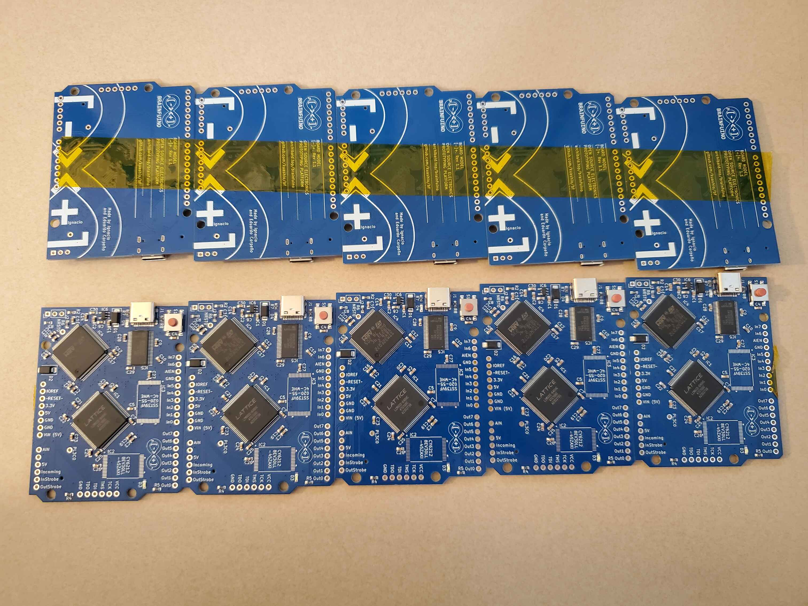
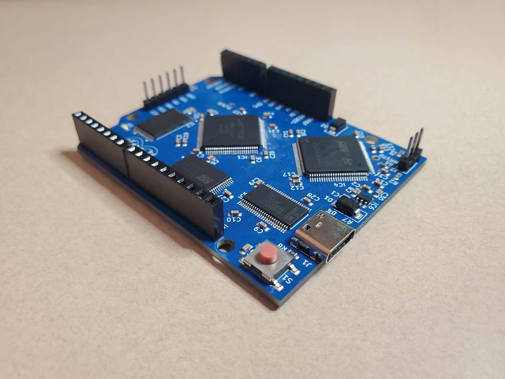

# Revision Comparison: Rev 1.0 vs Rev 1.1

The Brainfuino hardware has evolved through two primary revisions.

---

## High-Level Comparison

| Feature | Rev 1.0 | Rev 1.1 (Current) |
| :--- | :--- | :--- |
| **EDA Tool** | Autodesk Eagle (`.sch`, `.brd`) | **KiCad 9** (`.kicad_sch`, `.kicad_pcb`) |
| **Connector** | Micro-USB | **USB Type-C** |
| **Fabrication Prep** | Generic Eagle CAM outputs | **Pre-packaged JLCPCB Gerber, BOM, and CPL files** |
| **FPGA Pin Mapping** | Original pin assignments | **Optimized routing layout** (requires updated `.lpf` file) |
| **Trace Lengths & Timing** | Initial layout | **Length-checked parallel traces** with propagation delay calculations so data arrives synchronized |
| **Mounting & Case** | Standalone board | Tested with 3D printed case |

---

## FPGA Pin Mapping Changes (`.lpf`)

??? warning "FPGA Pin Mapping Changes (`.lpf`)"
    Revision 1.0 (micro-USB) and Rev 1.1 (USB-C) have slightly different pin assignments for the FPGA. Specifically, in Rev 1.1 the clock input pin was moved to a **dedicated clock-optimized FPGA pin**, which requires a different pin assignment (`.lpf`) file when compiling the firmware in Lattice Diamond:
    
    * Use `brainfuino_v1.1.jed` (or default `brainfuck_uP.lpf`) for **Rev 1.1 boards**.
    * Use `brainfuino_v1.0.jed` for older **Rev 1.0 Eagle boards**.
    * Precompiled `.jed` bitstreams for both revisions are located in [`brainfuck_uP-FPGA-softprocessor/bitstreams/`](https://github.com/m-archibald/Brainfuino/tree/main/brainfuck_uP-FPGA-softprocessor/bitstreams).

---

## Why Switch from Eagle to KiCad?

1. **Open & Accessible Toolchain:** KiCad 9 is completely open-source and free without board size or layer restrictions, making it much easier for community members to inspect, fork, and modify the design.
2. **Modern JLCPCB Integration:** Rev 1.1 uses the KiCad JLCPCB Fabrication Toolkit, generating accurate Pick-and-Place (CPL) and Bill of Materials (BOM) files automatically with matched LCSC part numbers.
3. **USB-C Upgrade:** Eliminates fragile micro-USB connectors in favor of modern, reversible USB Type-C connectivity.

*A manufactured panel of 5 Brainfuino Rev 1.1 boards fresh from JLCPCB: showing bottom silkscreen and top SMT assembly before hand-soldering unstocked memory chips.*

---

## Hand-Soldering Unstocked Components

When ordering small prototype batches from JLCPCB, certain specialized parallel memory ICs (such as the TSOP-32 SRAM or Flash ROM) may occasionally be out of stock in JLCPCB's local parts library.

*Completed Brainfuino Rev 1.1 board after hand-soldering TSOP-32 RAM/ROM and pin headers onto the SMT-assembled JLCPCB baseboard.*

