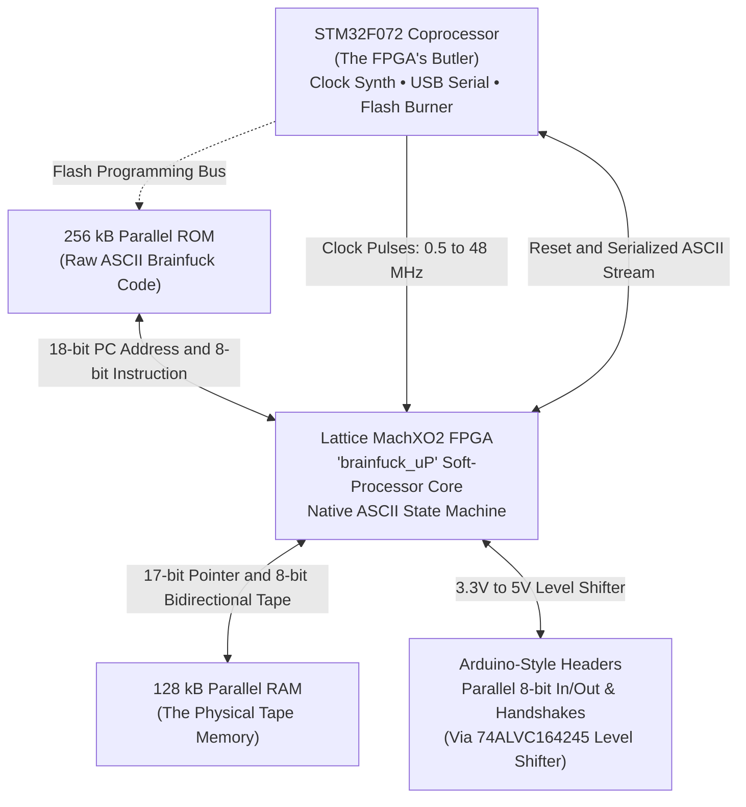

# Brainfuino [-]+.

> **Yes, this is real. Yes, it runs Brainfuck natively in silicon. No, we will not apologize.**

---

## The Joke That Went Way Too Far

Most programmers who discover [Brainfuck](https://en.wikipedia.org/wiki/Brainfuck)—the infamous 1993 esoteric language with only eight single-character commands (`+`, `-`, `<`, `>`, `[`, `]`, `.`, `,`)—write a quick 50-line interpreter in Python or C, giggle at the absurdity, and move on.

**We did not move on.**

Instead, the Brainfuino [-]+. (pronounced *"Brainfuino Uno"*) asks the ultimate question: *What if an Arduino ran Brainfuck directly in physical hardware?*

No compiler. No bytecode. No virtual machine. No emulation. 

When you write Brainfuck code for the Brainfuino, the raw ASCII characters (`0x2B` for `+`, `0x5B` for `[`, etc.) are written directly into a parallel Flash ROM chip. A soft-processor synthesized on a Lattice MachXO2 FPGA fetches those raw ASCII bytes and executes them instruction-by-instruction in real hardware logic gates.

---

## All Hail the Lattice MachXO2

In the Brainfuino universe, the **FPGA is the undisputed center of the cosmos**. Everything else on the board exists purely in humble service of the FPGA and its soft-processor core, **`brainfuck_uP`**:

* **The Soft-Processor (`brainfuck_uP`):** The heart of the machine. Implements a direct hardware state machine that treats raw ASCII Brainfuck as machine code.
* **The Butler (STM32F072):** The soft-processor was way too hardcore to talk to directly without an oscilloscope, so the STM32 handles user interaction: generating clock pulses, piping USB serial to your PC, and flashing new programs into ROM.
* **The Memory Chips:** Dedicated parallel chips give the FPGA a massive **128 kB data tape** (SRAM) and **256 kB program space** (Flash ROM).
* **The Form Factor:** Designed in the classic Arduino Uno footprint—mostly for the sheer comedy of having an "Arduino" that runs native Brainfuck!

---

## Why Would Anyone Build This?

Because nothing matches the feeling of:

* **Bragging rights:** You wrote a program in one of the hardest esoteric languages on earth, and you ran it on bare silicon.
* **Genuine engineering:** An FPGA soft-processor with Harvard architecture, parallel memory buses, clock synthesis, and custom level shifting.
* **Pure entertainment:** Watching ASCII characters fly by in a PuTTY serial console powered by hardware gates.

---

## Project Origins & The Team

The Brainfuino project is the brainchild of **Eduardo Corpeño**, a brilliant electrical and computer engineer, FPGA specialist, and university professor of 20+ years:

* Watch Eduardo's original video demo: **[Brainfuino: Hardware Brainfuck Processor (YouTube)](https://youtu.be/QloNq8AoHvU)**.
* Read the original project build log: **[Brainfuino on Hackaday.io](https://hackaday.io/project/176757-brainfuino)**.

Today, the project is maintained and expanded by:

* **Matthew Archibald (Hardware):** Hardware redesigns (Rev 1.1 in KiCad), PCB fabrication, 3D printable case engineering, and documentation.
* **Thalia Archibald (Software):** Software architecture, and curator of the [bfcorpus repository](https://github.com/thaliaarchi/bfcorpus).

---

## Explore the Docs

Use the left sidebar to navigate the guides:

* **[Quick Start Guide](user-guide/quick-start.md):** Connect via USB and run your first Brainfuck program in under 5 minutes.
* **[Terminal Commands](user-guide/terminal-commands.md):** Clock speed toggles (`1`–`7`), program dump (`!`), output buffer dumping (`@`), and upload instructions.
* **[Hardware & PCB](hardware/overview.md):** Schematic walkthrough, BOM, level shifting, and the actual header pinout.
* **[FPGA Soft-Processor](fpga/architecture.md):** Deep dive into the `brainfuck_uP` Verilog core, state machine, and bracket depth counter.
* **[STM32 Firmware](firmware/architecture.md):** Coprocessor architecture, clock generator, USB CDC, and memory flashing.
* **[3D Printed Case](case/assembly.md):** Printing specs and assembly instructions.
* **[Brainfuck Guide & Examples](brainfuck/language-guide.md):** Language cheat sheet, hardware quirks, and tested sample programs.