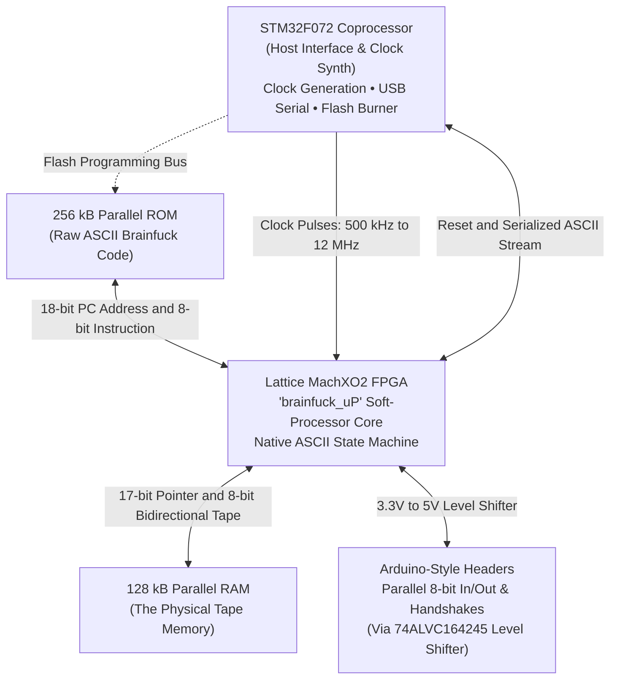

# Brainfuino [-]+.

> **Yes, this is real. Yes, it runs Brainfuck natively in silicon. No, we will not apologize.**

-   

    ---

    **Rev 1.1 Hardware**
    
    Lattice MachXO2 FPGA soft-processor paired with an STM32F072 coprocessor, parallel SRAM tape memory, and Flash ROM.

-   

    ---

    **Custom 3D-Printed Enclosure**
    
    Protective portable case with status LED illumination, single-screw assembly, and exposed programming cutouts.

---

## What is Brainfuino?

You may have seen the Brainfuino [Hackaday project](https://hackaday.com/2021/01/12/make-room-for-a-new-arduino-competitor-with-native-brainfck/) released during COVID in 2021. Originally created by Eduardo Corpeño, it's a programming board that runs the esoteric programming language Brainfuck completely in hardware. The language is extremely minimal, with just 8 characters, yet it is entirely Turing complete. When uploading code to the Brainfuino, there is no conversion or compression, the ascii brainfuck characters are saved into rom exactly as they are written. Programming in Brainfuck is difficult, hilarious, and rewarding, and doing it with Brainfuino is even better.

---

## Two Processors: Pure Hardware and Quality of Life

There are two processors on the Brainfuino, the actual Brainfuck based soft processor implemented in hardware on the Lattice FPGA, and the STM32 which makes the whole thing user "friendly". Since the FPGA is configured basically as an old fashioned Harvard CPU, instructions move through the soft processor in a continuous stream of parallel bits, these flash into and out of existence, and the STM32 is there to catch them and serialize them so you can use it with a modern PC instead of an ancient parallel based terminal interface. The FPGA does all the hard work here though. When programs are run, all the output is being generated real time in hardware via the FPGA. The FPGA reads bytes of data from good old parallel flash program memory, and when it encounters bytes representing one of the 8 ascii characters used in Brainfuck it executes that with its built in soft processor based instruction set according to the character. Since it's a harvard style cpu, it also uses parallel based RAM to read and write data to and from for computation purposes. The STM32 uses its hardware timer to drive a clock pin to the FPGA at speeds from 500 khz up to 12 mhz. You may wonder if the STM32 is overkill, and your curiosity is valid, it probably is overkill, but by leveraging a separate microcontroller for these quality of life improvements, it allows the Brainfuck soft processor implemented in Verilog on the Lattice FPGA to remain pure and stay true to its purpose to compute Brainfuck. We leave the rest to the STM32: Usb communication, parallel to serial conversion, program memory flushing and prep, variable clock speed control, and an interactive terminal interface.

---

## Why Brainfuino?

As to answer the question of why? Well: The challenge. And to quote the original author Eduardo Corpeño, with the Brainfuino you get "bragging rights for writing code that works! You certainly won't get that from the Arduino."

---

## What's in Revision 1.1

My revision 1.1 of the Brainfuino has:
- Improved clock routing to the FPGA soft processor using an FPGA pin optimized for clock input rather than a generic GPIO
- Proper VBus to 3.3v connection on the STM32 increasing STM32 clock stability
- JLCPCB compatible parts list and reduced cost by switching to prestocked "basic" components.
- USB C!
- A nifty 3D printed case
- KiCAD design files (migrated from the original Autodesk Eagle)

See the original demo video: [Brainfuino: Hardware Brainfuck Processor (YouTube)](https://www.youtube.com/watch?v=QloNq8AoHvU)

---

## Project Origins & The Team

The Brainfuino project is the brainchild of **Eduardo Corpeño**, a brilliant electrical and computer engineer, FPGA specialist, and university professor of 20+ years:

* Watch Eduardo's original video demo: **[Brainfuino: Hardware Brainfuck Processor (YouTube)](https://youtu.be/QloNq8AoHvU)**.
* Read the original project build log: **[Brainfuino on Hackaday.io](https://hackaday.io/project/176757-brainfuino)**.

Today, the project is maintained and expanded by:

* **Matthew Archibald (Hardware):** Hardware redesigns (Rev 1.1 in KiCad), PCB fabrication, 3D printable case engineering, and documentation.
* **Thalia Archibald (Software):** Software architecture, and curator of the [bfcorpus repository](https://github.com/thaliaarchi/bfcorpus).

---

## Explore the Docs

Use the left sidebar to navigate the guides:

* **[Quick Start Guide](user-guide/quick-start.md):** Connect via USB and run your first Brainfuck program in under 5 minutes.
* **[Terminal Commands](user-guide/terminal-commands.md):** Clock speed toggles (`1`–`7`), program dump (`!`), output buffer dumping (`@`), and upload instructions.
* **[Hardware & PCB](hardware/overview.md):** Schematic walkthrough, BOM, level shifting, and the actual header pinout.
* **[FPGA Soft-Processor](fpga/architecture.md):** Deep dive into the `brainfuck_uP` Verilog core, state machine, and bracket depth counter.
* **[STM32 Firmware](firmware/architecture.md):** Coprocessor architecture, clock generator, USB CDC, and memory flashing.
* **[3D Printed Case](case/assembly.md):** Printing specs and assembly instructions.
* **[Brainfuck Guide & Examples](brainfuck/language-guide.md):** Language cheat sheet, hardware quirks, and tested sample programs.
* **[Project Roadmap](roadmap.md):** Planned firmware modes, dynamic clock throttling, multi-program storage, and potential future ideas.