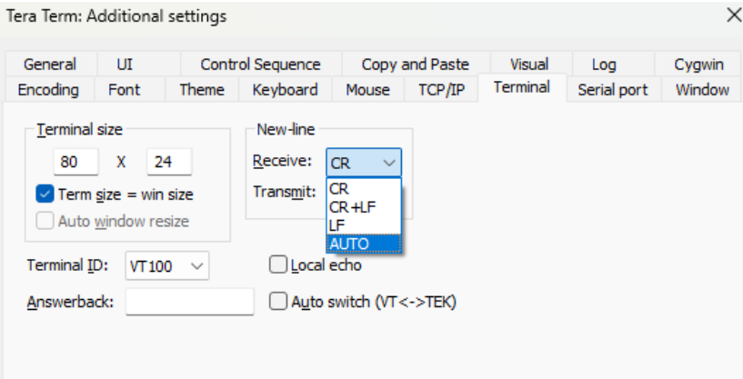
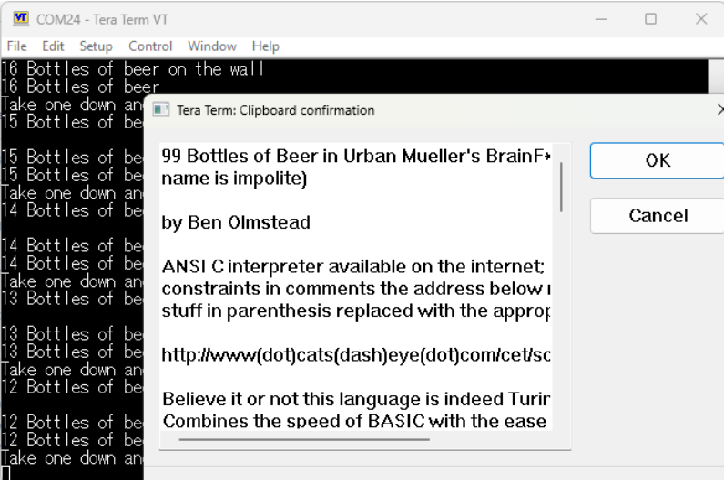

# Quick Start Guide

Getting started with Brainfuino is remarkably simple. Because the board uses standard USB CDC (Virtual COM Port) emulation, no proprietary drivers or software suites are needed—just a serial terminal like PuTTY, Tera Term, minicom, or screen.

---

## 1. Connect Hardware

1. Plug a **USB-C data cable** into your computer and the Brainfuino.
2. The onboard power LEDs will illuminate, and your computer will detect an **STM32 Virtual COM Port** (e.g., `COM3` on Windows, `/dev/ttyACM0` on Linux, `/dev/cu.usbmodem...` on macOS).

---

## 2. Open a Serial Terminal

Open your serial terminal emulator of choice:

* **Windows:** [PuTTY](https://putty.org/) or [Tera Term](https://ttssh2.osdn.jp/)
* **Linux:** `screen /dev/ttyACM0 115200` or `minicom -D /dev/ttyACM0`
* **macOS:** `screen /dev/cu.usbmodem* 115200`

### Recommended Settings

| Setting | Value |
| :--- | :--- |
| **Port** | Assigned Virtual COM Port |
| **Baud Rate** | Any (Hardware USB CDC ignores baud settings) |
| **Data Bits** | 8 |
| **Parity** | None |
| **Stop Bits** | 1 |
| **Flow Control** | None |

??? tip "Preventing 'Stair-Stepping' in Serial Terminals"
    If incoming text steps diagonally across your terminal screen without returning to the left margin on newlines:
    * **In Tera Term:** Go to **Setup → Terminal → New-Line → Receive** and select **AUTO**.
    * **In PuTTY:** Under **Terminal**, check **Implicit CR in every LF**.
    
    

---

## 3. Run the Installed Program

1. Ensure the **BOOT jumper** is moved back to normal run mode so the STM32 can boot.
2. Press the **Reset Button** on the Brainfuino board.
3. The FPGA soft-processor resets its Program Counter (`pc = 0`), resets its Data Pointer (`p = 0`), and begins executing the program stored in parallel Flash ROM.
4. The board immediately executes the program and streams output directly to your serial console!

---

## 4. Uploading a New Brainfuck Program

The companion STM32 coprocessor monitors incoming serial packets: any pasted text will automatically be written to the parallel Flash memory.

1. Open any Brainfuck source file in your text editor and copy the code to your clipboard.
2. **Right-click** in your terminal emulator (e.g. Tera Term or PuTTY) to paste the code in.
3. When the incoming packet length is **3 or more bytes**, the STM32 automatically:
    * Pulls the FPGA reset line low (`BF_RST = 0`), pausing the soft-processor.
    * Turns on the status LED.
    * Erases the parallel Flash ROM sectors.
    * Writes the new code byte-by-byte into the parallel ROM.
    * Responds in the terminal: `Wrote <N> bytes`.

    

4. Press the hardware **Reset Button** on the Brainfuino to boot the FPGA into your new program!

```brainfuck title="Simple Hello World Example"
+[-->-[>>+>-----<<]<--<---]>-.>>>+.>>..+++[.>]<<<<.+++------.<<<.>>>>+.[-]+[]
```

---

## 5. Helpful Tips & Program Halting

??? tip "Stopping your program gracefully: The `[-]+[]` Idiom"
    **The Processor Never Stops!**
    
    The FPGA state machine fetches and executes bytes from ROM relentlessly. When it reaches the end of your code, it will march through empty ROM until it hits address 262,143, wrap back around to address 0, and run the code all over again.
    
    To prevent your program from restarting in an endless loop, end your program with an intentional halt loop.
    
    **The Flawed Approach (`+[]`):**
    Many tutorials suggest `+[]`. However, if your current memory cell happens to contain **255**, adding 1 wraps the cell around to **0** (`255 + 1 = 0`). The loop `[]` checks if the cell is non-zero, sees `0`, skips right over the loop, and the program restarts anyway!
    
    **The Robust Idiom (`[-]+[]`):**
    ```brainfuck
    [-]+[]
    ```
    * `[-]`: Decrements the cell until it is guaranteed to be `0` (even if it started at 255).
    * `+`: Increments `0` to `1`.
    * `[]`: Enters an infinite loop on `1`, safely halting the processor forever!

??? note "Single-Key Commands"
    When you press a single key (packet length under 3 bytes), the STM32 interprets hotkeys:
    
    * **Keys `1` through `7`:** Change FPGA clock frequency (500 kHz to 48 MHz).
    * **Key `!`:** Dump the entire program currently stored in ROM.
    * **Key `@`:** Retransmit buffered serial data from the FPGA output buffer.
    
    See the [Terminal Commands Reference](terminal-commands.md) for full details.