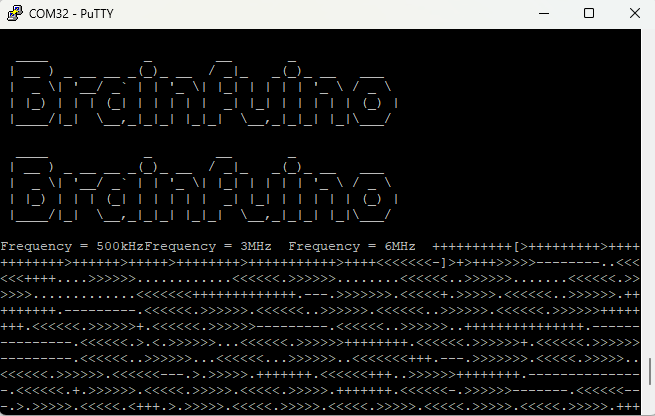

# Quick Start

**The Brainfuino is exceptionally easy to program. To get started follow these quick steps.**

1. Connect the Brainfuino to your computer using a USB-C data cable

2. Open your favorite Serial Terminal program
    - [Putty](https://putty.org/index.html) works well

3. Connect to the Brainfuino via its COM Port at any Baud Rate

4. Press the reset Button on the Brainfuino to reboot the FPGA based Brainfuck microprocessor and run the currently loaded BF program from ROM

5. As the FPGA computes the BF program, it will print ascii to terminal and you can interact with the program like with a browser based BF interpreter, but instead, in hardware

6. To program the Brainfuino with new BF code, simply open your favorite BF program with a text editor, copy it all, and paste it into the terminal emulator! The STM32 will handle writing the program to ROM for you, and upon the next reset, the FPGA will compute the new program.

7. The STM32 also provides a few other ease of use conveniences. To change the clock speed, input a number `1` through `6`, to dump the currently installed code, input `!`, to send the buffered ascii data last transmitted from the FPGA use `@`. 

8. Since valid brainfuck code can be as short as a few bytes, some keyboard characters will trigger a program ROM write, for example, insert, or page up, are both extended ascii and contain 4 bytes, pressing one of these will trigger a program write. If you would like to change this behavior, the STM32 code can be recompiled and overwritten. 

9. Lastly, as the brainfuck microprocessor never stops, if the program does not have a natural stopping point, the processor will keep iterating through the empty ROM until it reaches the end, then it will start over and execute the code again. It can help to implement endless loops at the end of your code if you do not wish for this to happen
    - +[] is an infinite loop of just 3 bytes

10. Have fun!

notes: include links or code snippets of example code